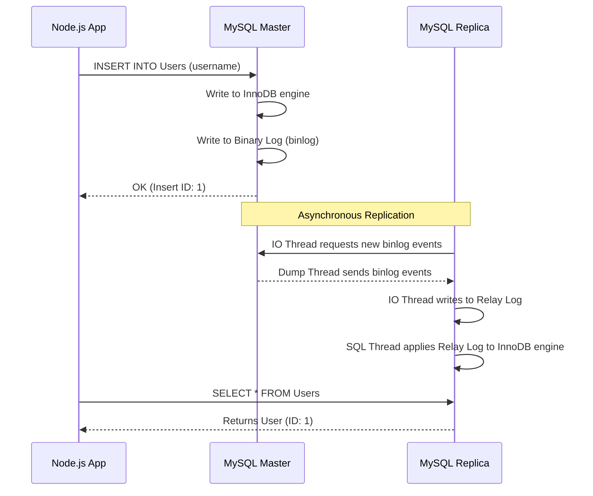
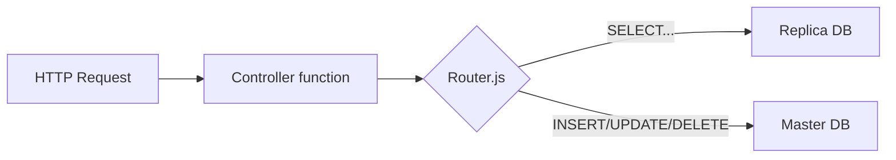
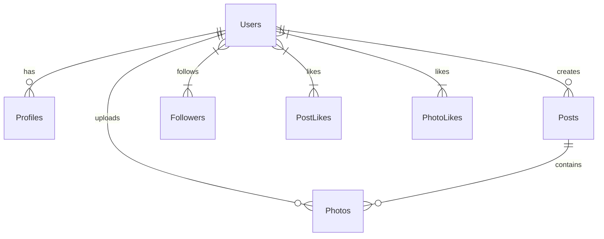

# Horizontal Scaling with MySQL Read Replicas

An educational open-source system design lab demonstrating how to scale a database horizontally using MySQL Read Replicas and Node.js application-level read/write routing.

## Problem Statement

As web applications grow, the database often becomes the first major bottleneck. A single database server can only process a finite number of queries per second. While you can vertically scale (buy a bigger server), there is a physical limit and cost barrier. How do we scale a database horizontally to handle massive read traffic?

## What is Horizontal Scaling?

Horizontal scaling (scaling out) involves adding more servers to share the load, rather than upgrading a single server (vertical scaling). In the context of databases, this introduces complexity because data must be synchronized across machines.

## Why Read Replicas?

Most web applications, especially social networks, are extremely read-heavy (e.g., 90% SELECTs, 10% INSERT/UPDATE/DELETE). By using a Primary-Replica architecture:
1. **Master (Primary)** handles all writes.
2. **Replicas (Secondary)** constantly copy data from the Master and handle all reads.
This immediately offloads 90% of the traffic from the primary server, allowing the system to scale massively.

## Architecture Diagram

```mermaid
graph TD
    Client[Web / Mobile Client] -->|HTTP REST| API[Node.js Express Backend]
    
    subgraph "Database Router (App Layer)"
        API --> Router{Is SELECT query?}
    end
    
    subgraph "Database Cluster"
        Router -->|No (INSERT, UPDATE, DELETE)| Master[(MySQL Master\nHandles Writes)]
        Router -->|Yes (SELECT)| Replica[(MySQL Replica\nHandles Reads)]
    end
    
    Master -->|Asynchronous Replication\n(Binary Log)| Replica
```

## Replication Flow



## Folder Structure

```
.
├── backend/                  # Node.js Express Application
│   ├── src/
│   │   ├── controllers/      # API logic (users, posts)
│   │   ├── database/         # Master & Replica connection pools, Database Router
│   │   ├── routes/           # REST endpoints
│   │   ├── middleware/       # Error handling
│   │   └── server.js         # Entry point
│   ├── Dockerfile
│   └── package.json
├── docs/                     # Educational Concepts
│   ├── horizontal-scaling.md
│   ├── read-replicas.md
│   ├── replication.md
│   ├── replication-lag.md
│   ├── consistency.md
│   └── failover.md
├── sql/                      # Database Setup Scripts
│   ├── replication/          # Master/Replica config (.cnf) and setup scripts
│   ├── schema.sql            # Table definitions (Users, Posts, etc.)
│   ├── seed.sql              # Initial dummy data
│   └── transactions.sql      # Example transactions
├── benchmark/                # Load Testing Scripts
├── docker-compose.yml        # Orchestrates the whole environment
└── .env.example              # Environment variables template
```

## How to Run

1. Clone the repository.
2. Ensure Docker and Docker Compose are installed.
3. Run the following command:
   ```bash
   docker-compose up -d --build
   ```
4. Verify the containers are running (`docker ps`). The backend runs on port 3000.
5. Manually configure the replica by running the configuration script inside the replica container:
   ```bash
   docker exec -i mysql-replica mysql -uroot -prootpassword < ./sql/replication/configure-replica.sql
   ```
6. Check replication status:
   ```bash
   docker exec -i mysql-replica mysql -uroot -prootpassword -e "SHOW REPLICA STATUS\G"
   ```
   *Look for `Slave_IO_Running: Yes` and `Slave_SQL_Running: Yes`.*

## How Query Routing Works

The backend contains a custom `DatabaseRouter` (`backend/src/database/router.js`). When an API endpoint executes a query, it calls `router.query()`. The router inspects the SQL string. If it begins with `SELECT` (and doesn't contain `FOR UPDATE`), it sends the query to the Replica connection pool. All other queries go to the Master connection pool.



## Social Network ER Diagram



## Advantages
- Massive increase in read throughput.
- Analytical queries won't lock production tables.
- Built-in disaster recovery (promote replica if master dies).

## Limitations
- Eventual consistency (stale reads).
- Application logic complexity (routing).
- Does not scale write throughput (requires Sharding).

## Future Improvements
- Implement Read-Your-Writes consistency (route reads to Master for 10s after a write).
- Add more replicas and put a load balancer (like HAProxy or ProxySQL) in front of them instead of application-level routing.
